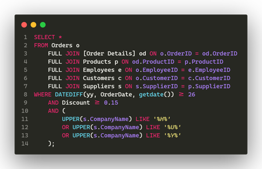

# Part 3

## Image

## Execution plan file `.sqlplan`

| Not Tuning                | Tuning (Live Query Statistics) | Tuning (Actual Execution Plan) |
| ------------------------- | ------------------------------ | ------------------------------ |
| `before tuning 1.sqlplan` | `tuning 1.1.sqlplan`           | `tuning 1.2.sqlplan`           |
| `before tuning 2.sqlplan` | `tuning 2.1.sqlplan`           | `tuning 2.2.sqlplan`           |

## File sql

`part3.sql`

## File backup Database

Backup database to `Northwind.bak` file.
